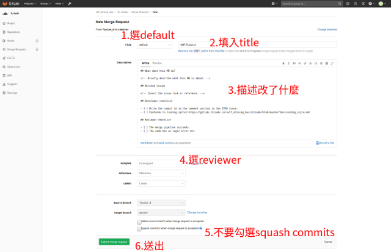

### 開發流程

大家工作的統合成果放在 master branch，
然在開發過程可能會做多次改動，並非一次commit就可以交付成果，若中介commit直接上到master
branch, 會讓master出現 build
fail或甚至是無法執行等問題，為了兼顧開發上的便利性以及master
branch的穩定性，我們在開發上使用以下的流程。

為了說明上的方便，假設您要新加一個功能進來，流程是先從master
branch分支出來一個自己在用的branch (姑且稱為awesome_feature)，
修改回之後push 到repository，
新增一個merge request，
reviewer 完之後，就會自動merge回master branch裡，詳細的指令如下。

```
# 下載repository到local電腦
$ git clone https://gitlab.itriadv.co/self_driving_bus/itriadv.git
$ git branch
* master   # We are at branch master
$ git checkout -b awesome_feature  # 新增並切到 awesome_feature branch。

# 重覆以下兩動直到feature完成：
$ 改code
$ git add your_code.cpp
$ git commit

# OK, 新功能已加到awesome_feature branch裡，要push回gitlab了
$ git push
```

接下來就是送出merge request:
1. 到 gitlab的 [itriadv 頁面](https://gitlab.itriadv.co/self_driving_bus/itriadv)。
2. 點選左側欄的Merge Requests。


3. 點選New Merge Request綠色按鈕。
4. 在Select source branch點一下並選擇awesome_feature，右方的target branch選master，然後點下Compare branches and continue綠色按鈕。


5. 填入以下資訊，其中Title和Description類推適用git commit時的動作。
    * Title
    * Description
    * 點選Assignee，挑選一個適當的reviewer
    * **不要**打勾 Squash commits when merge request is accepted
6. 點下Submit merge request.




系統會自動寄信給Reviewer, 當他Review完及點下approve後, code就會自動merge到master branch裡，整個流程就告一段落。

### 挑選 Reviewer

Reviewer需要有maintainer權限，目前有
@root (austin)
@Wayne
@chtseng
@hankliu
@chinghao.liu

### 常見問題

#### 要怎麼把master branch裡的code merge到自己的local branch?

以下為例，我們想要把最新的master branch merge 回camera_grabber裡

```
# 檢查目前local repository的設定
$ git branch -a
* camera_grabber  # 目前所在的branch
  master          # local repository裡的master branch
  remotes/origin/camera_grabber
  remotes/origin/control_team
  remotes/origin/docs
  remotes/origin/drivenet
  remotes/origin/fusion_d
  remotes/origin/localization
  remotes/origin/master  # remote repository裡的master branch，這是我們要merge的來源
  remotes/origin/parknet
  remotes/origin/tracking_pp

# 把最新的code抓回來
$ git pull
remote: Enumerating objects: 62, done.
remote: Counting objects: 100% (62/62), done.
remote: Compressing objects: 100% (47/47), done.
remote: Total 62 (delta 3), reused 0 (delta 0)
Unpacking objects: 100% (62/62), done.
From ssh://gitlab.itriadv.co:7022/self_driving_bus/itriadv
   80b4a3b..ca84b9f  control_team -> origin/control_team
   54159f0..cd455d7  master     -> origin/master

# 把master merge到camera_grabber裡
$ git merge remotes/origin/master --no-ff
Merge made by the 'recursive' strategy.
 src/control/GUI_Publisher/CMakeLists.txt                                         |    67 +
...
```

注意，git merge 的來源是remotes/origin/master, 不是自己local裡的master喔。


